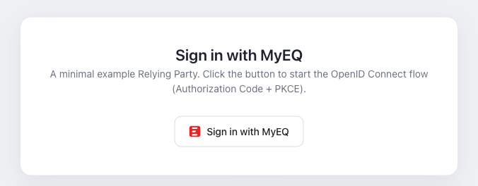

<h1 align="center">
    <a href="https://europequalitegroup.com/fr">
        <picture>
            <source width="280" media="(prefers-color-scheme: dark)" srcset="https://europequalitegroup.com/img/logo.svg">
            
        </picture>
    </a>
</h1>

<h2 align="center">Sign in with MyEQ</h2>

<p align="center">
    <em>A minimal, framework-agnostic example showing how to add <strong>“Sign in with MyEQ”</strong> to any web app — OpenID Connect, Authorization Code flow with PKCE.</em>
</p>

<p align="center">
    
    
    
    
    
</p>

<p align="center">
    
</p>

---

## ✨ What it does

- Renders the branded **Sign in with MyEQ** button (themable, light/dark, several shapes & sizes).
- Runs the full OpenID Connect login: redirect → **Authorization Code + PKCE** → callback → tokens.
- Displays the signed-in user’s profile claims, with a **Sign out** action.
- Ships an interactive **button customizer** so you can preview every variant and copy the markup.

> No backend, no client secret — it runs entirely in the browser and deploys as
> static files. Vanilla TypeScript on purpose: the same approach drops into
> React, Vue, Svelte or plain HTML.

---

## 🚀 Quick start

> **Prerequisite** — ask a MyEQ administrator to register a **public** OAuth client
> (Internal portal → **System → OAuth Clients**, enable *public client*) with your
> redirect URI, e.g. `http://localhost:5173/callback.html`. Redirect URIs are
> matched **exactly** (no wildcards), so register every origin you run from.

```bash
cp .env.example .env      # then set your client_id / authority
npm install
npm run dev               # http://localhost:5173
```

Build the static site:

```bash
npm run build && npm run preview
```

---

## 🔧 Configuration

Set these in your `.env` (all prefixed with `VITE_` so Vite exposes them):

| Variable                 | Description                                            |
| ------------------------ | ------------------------------------------------------ |
| `VITE_OIDC_AUTHORITY`    | Issuer URL — `https://auth.europequalitegroup.com`     |
| `VITE_OIDC_CLIENT_ID`    | Your registered `client_id`                            |
| `VITE_OIDC_REDIRECT_URI` | Must match a registered redirect URI                   |
| `VITE_OIDC_SCOPE`        | Space-separated scopes (`openid` is mandatory)         |

Every endpoint is discovered from
`${VITE_OIDC_AUTHORITY}/.well-known/openid-configuration`.

---

## 🧩 Integrate into your app

**1. The button** — copy [`src/signin-button.css`](src/signin-button.css) and the
markup below. It is plain HTML/CSS with no dependencies:

```html
<button class="eq-signin eq-signin--light eq-signin--md eq-signin--rounded">
  <span class="eq-signin__logo"><!-- inline EQ mark SVG --></span>
  <span class="eq-signin__label">Sign in with MyEQ</span>
</button>
```

**2. The OIDC client** — see [`src/auth.ts`](src/auth.ts). The essentials:

```ts
import { UserManager } from 'oidc-client-ts'

const userManager = new UserManager({
  authority: 'https://auth.europequalitegroup.com',
  client_id: 'my-demo-rp',
  redirect_uri: window.location.origin + '/callback.html',
  response_type: 'code',          // PKCE is enabled automatically
  scope: 'openid profile email',
})

button.onclick = () => userManager.signinRedirect()
```

On your redirect page, finish the flow ([`src/callback.ts`](src/callback.ts)):

```ts
await userManager.signinRedirectCallback()
```

---

## 🎨 Customize

The button is driven entirely by CSS — combine class modifiers, and override the
`--eq-signin-*` custom properties to retheme it. Run the demo and use the
**“Customize the button”** panel to preview combinations and copy the markup.

| Group  | Options                                                        |
| ------ | ------------------------------------------------------------- |
| Theme  | `--light` · `--dark` · `--auto` (follows the OS)              |
| Size   | `--sm` · `--md` · `--lg`                                       |
| Shape  | `--rounded` · `--pill`                                         |
| Layout | `--block` (full width) · `--icon` (mark only, drop the label) |

```css
/* Re-theme via custom properties */
.eq-signin {
  --eq-signin-accent: #e42528;   /* focus ring */
  --eq-signin-radius: 10px;      /* corner radius (rounded shape) */
}
```

---

## 🔒 Security

- **PKCE (S256)** is mandatory for every MyEQ client and handled automatically.
- Tokens are kept in `sessionStorage` (cleared when the tab closes). Browser
  storage is readable by any script on the page, so for production or long-lived
  sessions prefer a server-side (confidential) client or a BFF with HttpOnly
  cookies.
- The redirect callback only returns to **same-origin** paths (no open redirect).
- Always register **exact** redirect URIs and serve over **HTTPS** in production.

---

## 📁 Project structure

```
index.html            Home page: demo + button customizer
callback.html         OAuth redirect page
src/
  auth.ts             UserManager configuration (adapt this)
  callback.ts         Redirect callback handler
  main.ts             Home page logic (render signed-in / signed-out)
  playground.ts       Interactive button customizer
  signin-button.css   Framework-agnostic button styles
  styles.css          Demo page styles
```

---

## 📄 License

[MIT](LICENSE) © Europe Qualité
